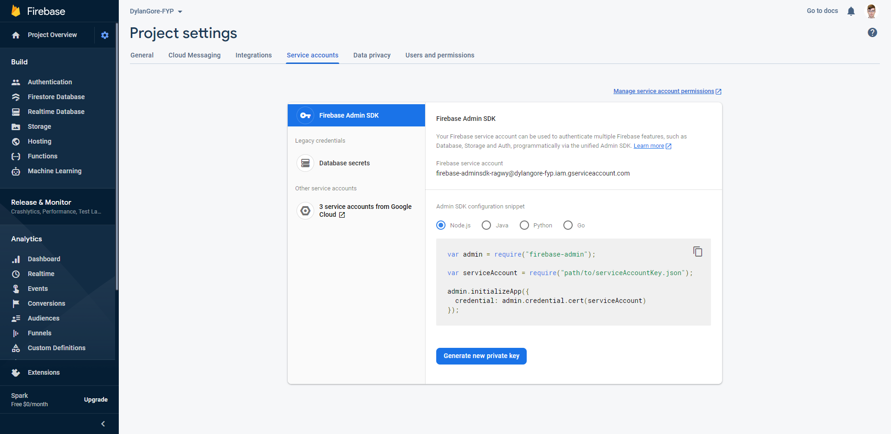

# Firebase Authentication

## What is Firebase?

Both the Dashboard and API use Google's [Firebase](https://firebase.google.com/) service as an authentication backend. Firebase provides a number of features but in this case the only one being used is [Firebase Authentication](https://firebase.google.com/products/auth).

Firebase Authentication allows for multiple login providers including standard e-mail address & password logins as well as Google, Microsoft, Twitter, Facebook, etc. All of this integration and account storage is handled by Firebase.

Firebase can be a paid subscription service but in the case of this system, all of the features used are included in the [free plan](https://firebase.google.com/pricing).

## Setting Up a Firebase Project

To begin, you will need to log in to the [Firebase Console](https://console.firebase.google.com/) with a Google Account. Once here you need to create a new project, as shown.

{ loading=lazy }

Once your project has been created, you will be redirected to the dashboard.

{ loading=lazy}

## Adding an App

You now need to create an app, this will generate a set of credentials that the Vehicles Dashboard needs to communicate with Firebase. To do this, simple click on the Web App icon (third button from the left) on the Firebase Dashboard.

You will then be asked to give the app a name.

{ loading=lazy }

<!-- prettier-ignore -->
!!! info
    Make sure the option for Firebase Hosting is not checked, it is not used in this setup.

Once the app has been registered, the Firebase config for the app will be displayed. Take note of these values as they are required to run the Vehicle Dashboard.

{ loading=lazy }

<!-- prettier-ignore -->
!!! warning
    Make sure to keep these details secure!

## Getting Credentials for the Vehicle API

The API uses the Firebase Admin SDK to interface with Firebase to validate user tokens. It uses a service account to do this. To access the credentials for the service account, go to your _Project Settings_ (Gear icon on the top left of the Firebase Dashboard) and _Service Accounts_.

{ loading=lazy }

From here, you have the option to _Generate a new private key_, click the button and you will be prompted to download a file, name it `serviceAccountKey.json` and save it for later use.

<!-- prettier-ignore -->
!!! danger
    Again, keep this file secure! It grants administrator access to your Firebase project.

## Authentication Providers

Firebase (and by extension the Vehicle Dashboard) supports multiple login providers, at a minimum you must enable the Email/Password login after that the choice is your as to what other providers to enable, if any.

To enable authentication, go to the Authentication section of the Firebase Dashboard via the link in the sidebar. Once here, follow the on-screen instructions to complete the initial setup.

After that, authentication providers can be enabled/disabled as needed via the _Sign-in method_ tab.

### Email/Password & Google Login

To enable either of these providers, simply select them from the list, change the switch to _Enabled_ and click _Save_.

<!-- prettier-ignore -->
!!! info
    Email link (Password-less sign-in) is not supported.

### Phone & Anonymous Login

The Phone and Anonymous sign-in providers are not currently supported by the Vehicles Dashboard.

### Other Providers

The instructions to enable the other providers can vary, in most cases it requires registering an app with the required provider and inputting the API key(s) into the configuration form under that provider in the _Sign-in method_ section.

The Firebase documentation contains setup instructions for each provider.

- [Facebook](https://firebase.google.com/docs/auth/web/facebook-login)
- [Apple](https://firebase.google.com/docs/auth/web/apple)
- [Twitter](https://firebase.google.com/docs/auth/web/twitter-login)
- [GitHub](https://firebase.google.com/docs/auth/web/github-auth)
- [Microsoft](https://firebase.google.com/docs/auth/web/microsoft-oauth)
- [Yahoo](https://firebase.google.com/docs/auth/web/yahoo-oauth)

<!-- prettier-ignore -->
!!! info
    Please note that in the guides above you only need to follow the instructions to the point of obtaining API keys or other required credentials. Once you have those, that should be enough to add the provider to Firebase.

## Authorized Domains

As a security measure, Firebase only allows login using third-party providers (everything excluding email/password in this case) from a list of authorized domains. Make sure to add the domain/IP address that the Vehicle Dashboard will be accessible at is added to this list. It is found below the list of sign-in providers.
